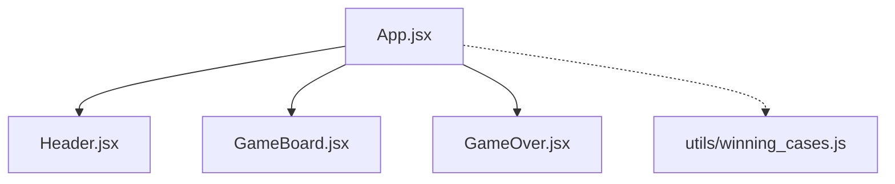
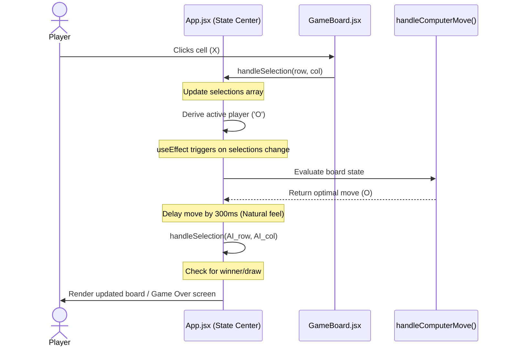

# 🎮 ImpossibleXO — Unbeatable Tic-Tac-Toe

**ImpossibleXO** is a premium,fully responsive, unbeatable Tic-Tac-Toe web application. Built with **React 19** and **Vite 7**, it features an advanced deterministic AI engine that maps out every possible game scenario, making it mathematically impossible for a human player to defeat the computer.

---

## 🔗 Live Deployment
Play the game online: [https://impossible-xo.vercel.app/](https://impossible-xo.vercel.app/)

---

## 🧠 What It Solves & How Better It Is

Standard Tic-Tac-Toe games often suffer from two major flaws:
1. **Predictable/Weak AI:** They use random selection or simple checks, making them too easy to defeat.
2. **Computational Overhead:** Advanced versions use the **Minimax Algorithm**, which recursively simulates the game tree. While effective, Minimax has a complexity of $O(b^d)$ (up to $9!$ or $362,880$ state checks for a blank board).

### 🚀 The ImpossibleXO Advantage: $O(1)$ Complexity Engine
Instead of executing heavy graph search algorithms on every turn, **ImpossibleXO** uses a custom-tailored **Deterministic Heuristic Decision Tree**. 

* **Instantaneous Decisions:** The computer evaluates the board and selects its move in **$O(1)$ time complexity**.
* **Zero CPU Spikes:** No recursive loops or tree lookups, making it highly battery-efficient and lightweight for mobile browsers.
* **100% Flawless Defense:** The engine maps out every opening trap (including diagonal forks, double-edge traps, and corner-opening traps) to guarantee a win or a draw.

---

## 🛠️ Tech Stack

* **Core Library:** React 19 (Hooks: `useState`, `useEffect`)
* **Build Tool & Bundler:** Vite 7 (Lightning-fast HMR and build optimization)
* **Programming Language:** JavaScript (ES6+ modern syntax)
* **Styling & Theme:** Vanilla CSS3
  * Frosted-glass aesthetics (Glassmorphism using CSS `backdrop-filter`)
  * Smooth transition animations (`pop-in` keyframes for game over states)
  * Flexbox & CSS Grid layouts
  * Responsive media queries optimized for viewports down to `350px` width
* **Linting:** ESLint 9 (Flat configuration format)
* **Hosting/Deployment:** Vercel

---

## 📐 System Architecture & Data Flow

ImpossibleXO leverages a **derived-state architecture** where all game details (board configuration, active player, winning symbol, and game status) are calculated on the fly from a single source of truth: the `selections` array. This eliminates state-synchronization bugs.

### Component Structure


### Data Flow Diagram


---

## 💡 Key Design Implementations & Features

### 1. Deterministic Heuristic AI Engine
The AI evaluates board coordinates based on specific branches:
* **Immediate Priorities:** 
  1. If the computer has an immediate winning move, make it.
  2. If the user has an immediate winning move, block it.
* **If User Starts:**
  * **Center Opening:** AI takes a corner, forcing the user to defend.
  * **Corner Opening:** AI occupies the Center `(1,1)` and counters diagonal fork strategies by taking edges.
  * **Edge Opening:** AI occupies the Center `(1,1)` and manages complex edge-to-edge traps by selecting specific corners.
* **If Computer Starts:**
  * AI opens by playing the Center `(1,1)` to establish control over maximum winning vectors (horizontal, vertical, diagonal).
  * Automatically sets up diagonal/corner forks depending on the user's first response.

### 2. Alternating Starting Players
When clicking **Restart**, the starting player alternates between `X` and `O`. This provides two unique gameplay dimensions:
* Playing as `X` (User goes first, trying to find a loophole in the AI's defense).
* Playing as `O` (User goes second, defending against the AI's active traps).

### 3. Realistic Thinking Delay
Instead of responding instantly (which ruins immersion), the AI uses an asynchronous `setTimeout` delay of **300ms** to simulate strategic calculation before placing its symbol.

### 4. Glassmorphic User Interface
Designed with rich, premium UI trends:
* Linear gradient backgrounds (`#8f49b1` to `#491caa`).
* Translucent panels using CSS Glassmorphism:
  ```css
  background: rgba(255, 255, 255, 0.15);
  backdrop-filter: blur(5px);
  border: 1px solid rgba(255, 255, 255, 0.3);
  ```
* Dynamic transitions, hover scales, and responsive scaling (`transform: scale(0.9)`) for optimal mobile layout support.

---

## ⚙️ Installation & Local Setup

### Prerequisites
Make sure you have **Node.js** (v18+) and **npm** (or **pnpm** / **yarn**) installed on your machine.

### 1. Clone the Repository
```bash
git clone https://github.com/Phantom-TA/Unbeatable-TicTacToe.git
cd Unbeatable-TicTacToe
```

### 2. Install Dependencies
```bash
npm install
```

### 3. Start the Development Server
Run the local Vite development server:
```bash
npm run dev
```
Open the provided URL (usually `http://localhost:5173`) in your web browser.

### 4. Build for Production
To bundle the project for production deployment:
```bash
npm run build
```
The optimized bundle will be created in the `dist` directory.

### 5. Preview Production Build Locally
```bash
npm run preview
```

---

## 📜 License
This project is open-source and available under the [MIT License](LICENSE).
